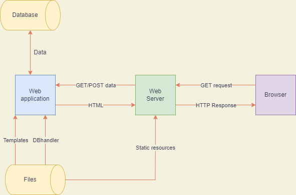
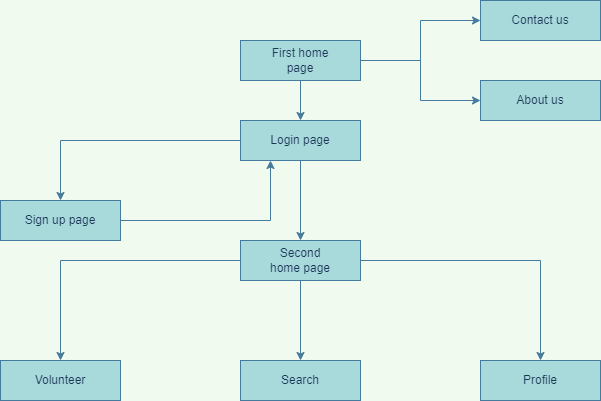

# Frontend
## Pages
### Login
Login page with email/username and password along with redirection to Sign up page.
### Sign up
Sign up page which takes several details.
### Profile
Profile page which displays all details of user.
### Volunteer
Page where users can provide details and set themselves as volunteers
### Search
Page where users can search for registered volunteers over a specific time frame

## Features
* Sign up
* Login/Logout
* Volunteer
* Search

# Backend
## API endpoints
* / (home page)
* /login
* /signup
* /logout
* /volunteer
* /search
* /profile/< user >
## DB connectors
From `handler.py`
* Login
* SignUp
* Volunteer
* Search

# Database
## Collections
### Login
* id (randomly generated by mongoDB)
* username (unique)
* password
### Profile
* id (custom set to match username for respective user)
* firstname
* lastname
* pincode
* city
* phno
* email
### Volunteer_status
* id (custom set to match username for respective user)
* start_date
* end_date
* preference

# Overview
## Frontend and backend

## General flow of the application
